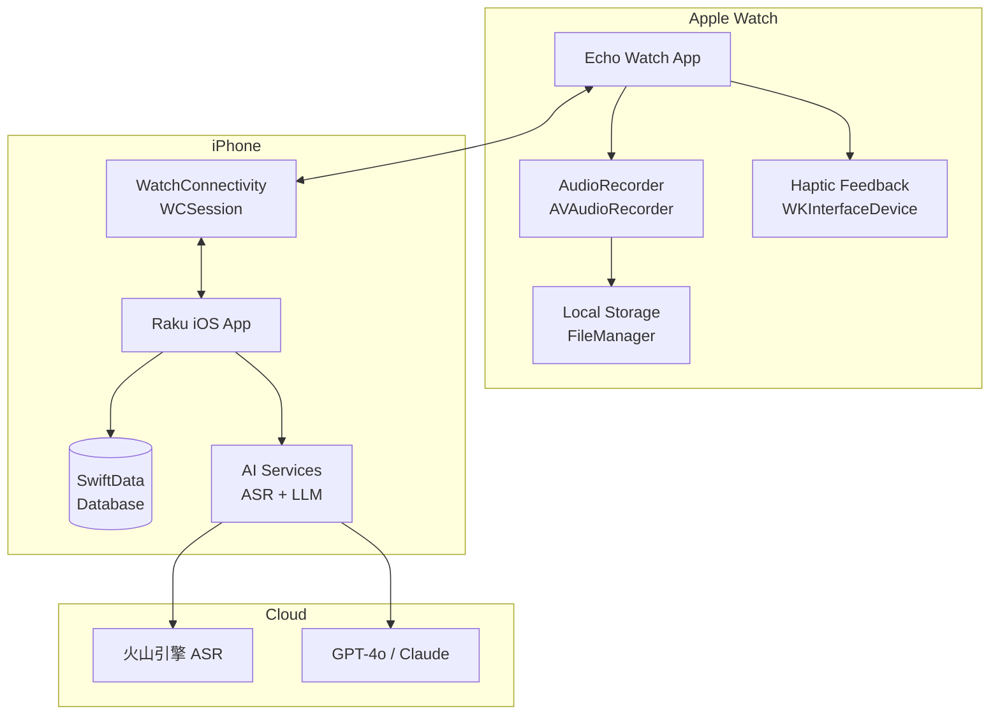
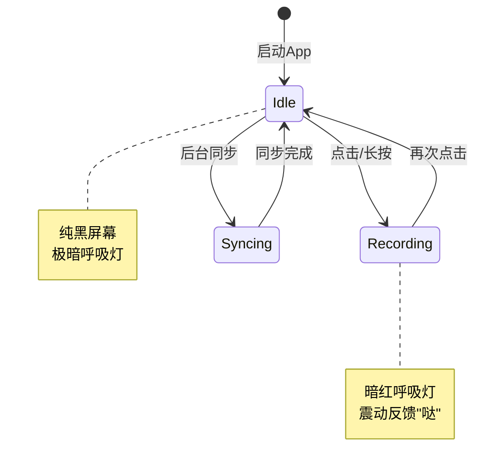
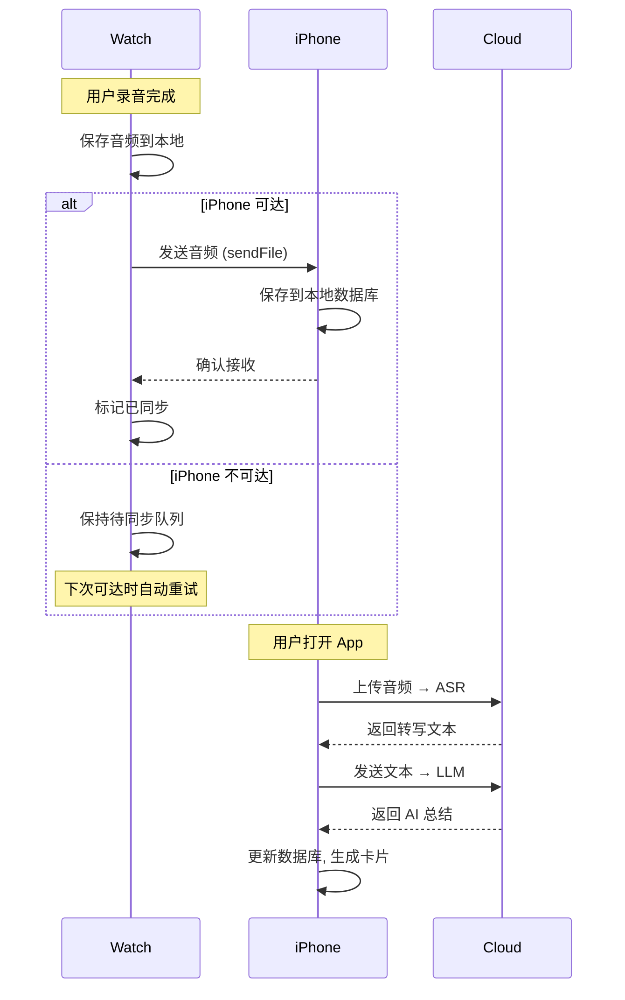

# 枕边灵感捕手 - watchOS 技术方案文档

## 产品概述

**枕边灵感捕手** 是一款"闭眼可操作"的极简语音记录器，专为 ADHD 人群、创作者、高敏人群设计。本文档描述如何在 Apple Watch 上实现 MVP 原型，利用现有 `raku` iOS 应用的后端服务能力。

---

## 系统架构



---

## 核心模块设计

### 1. 交互层 (Watch App)

#### 1.1 界面状态机



#### 1.2 UI 组件设计

| 组件 | 描述 | 实现技术 |
|------|------|----------|
| **黑屏模式** | 整个屏幕作为触发区域 | `GeometryReader` + `Color.black` |
| **呼吸灯** | 极低亮度暗红/暗绿微光 | `Animation.easeInOut.repeatForever` |
| **录音指示** | 隐蔽的视觉反馈 | `Circle` + `opacity(0.15)` |
| **录音列表** | Digital Crown 滚动查看 | `List` + `.listStyle(.plain)` |

#### 1.3 触觉反馈设计

```swift
// 开始录音: 单次重击 "哒"
WKInterfaceDevice.current().play(.start)

// 结束录音: 双次轻击 "哒哒"  
WKInterfaceDevice.current().play(.stop)
WKInterfaceDevice.current().play(.stop) // 延迟 200ms
```

| 事件 | Haptic 类型 | 触感描述 |
|------|-------------|----------|
| 开始录音 | `.start` 或 `.heavy` | 明确的单次震动 |
| 结束录音 | `.stop` × 2 | 两次轻柔震动 |
| 同步完成 | `.success` | 轻微确认震动 |
| 录音失败 | `.failure` | 错误提示震动 |

---

### 2. 录音层 (Audio Recording)

#### 2.1 音频配置

```swift
struct AudioConfig {
    // 推荐配置: 平衡音质与体积
    static let format: AVAudioFormat = .m4a
    static let sampleRate: Double = 16000  // 足够语音识别
    static let channels: Int = 1           // 单声道节省空间
    static let bitRate: Int = 64000        // 64kbps
    
    // 估算: 1分钟录音 ≈ 500KB
}
```

#### 2.2 录音服务类

```swift
actor WatchAudioRecorder {
    private var recorder: AVAudioRecorder?
    private var recordingURL: URL?
    
    // 开始录音
    func startRecording() async throws -> URL
    
    // 停止录音并返回文件信息
    func stopRecording() async throws -> RecordingInfo
    
    // 获取所有待同步录音
    func getPendingRecordings() async -> [RecordingInfo]
    
    // 删除已同步录音
    func deleteRecording(_ id: UUID) async
}

struct RecordingInfo: Codable, Identifiable {
    let id: UUID
    let fileURL: URL
    let duration: TimeInterval
    let createdAt: Date
    var isSynced: Bool
}
```

#### 2.3 存储策略

```
📁 Documents/
├── 📁 recordings/
│   ├── {uuid1}.m4a
│   ├── {uuid2}.m4a
│   └── ...
└── 📄 recording_metadata.json
```

---

### 3. 同步层 (WatchConnectivity)

#### 3.1 同步流程



#### 3.2 WatchConnectivity 实现

**Watch 端:**
```swift
class WatchConnectivityManager: NSObject, WCSessionDelegate {
    static let shared = WatchConnectivityManager()
    private let session = WCSession.default
    
    func activate() {
        if WCSession.isSupported() {
            session.delegate = self
            session.activate()
        }
    }
    
    // 发送录音文件到 iPhone
    func sendRecording(_ info: RecordingInfo) {
        let metadata: [String: Any] = [
            "id": info.id.uuidString,
            "duration": info.duration,
            "createdAt": info.createdAt.timeIntervalSince1970
        ]
        session.transferFile(info.fileURL, metadata: metadata)
    }
}
```

**iPhone 端:**
```swift
extension WatchConnectivityService: WCSessionDelegate {
    func session(_ session: WCSession, 
                 didReceive file: WCSessionFile) {
        // 1. 移动文件到 App 目录
        // 2. 创建 Recording 记录
        // 3. 触发 AI 处理流水线
    }
}
```

#### 3.3 同步状态管理

| 状态 | 描述 | Watch 显示 |
|------|------|-----------|
| `pending` | 等待同步 | 小圆点指示 |
| `syncing` | 正在传输 | 呼吸动画 |
| `synced` | 已同步到 iPhone | 勾选标记 |
| `processed` | AI 处理完成 | 隐藏/存档 |

---

### 4. 防误触机制

#### 4.1 多层防护设计

| 层级 | 机制 | 实现 |
|------|------|------|
| **L1: 物理隔离** | 利用 Digital Crown 锁定 | 旋转 Crown 解锁 |
| **L2: 时间门槛** | 长按 1 秒启动录音 | `LongPressGesture(minimumDuration: 1.0)` |
| **L3: 双击确认** | 结束时需双击 | `.gesture(TapGesture(count: 2))` |
| **L4: 静音检测** | 5秒无声自动暂停 | `AVAudioRecorder.averagePower` |

#### 4.2 实现示例

```swift
struct RecordingView: View {
    @State private var isRecording = false
    @State private var isLocked = true
    
    var body: some View {
        ZStack {
            // 全屏黑色背景
            Color.black.ignoresSafeArea()
            
            // 呼吸灯效果
            if isRecording {
                BreathingLight(color: .red, intensity: 0.15)
            }
        }
        .focusable()
        .digitalCrownRotation($unlockProgress)  // Crown 解锁
        .gesture(
            LongPressGesture(minimumDuration: 1.0)
                .onEnded { _ in
                    guard !isLocked else { return }
                    startRecording()
                }
        )
    }
}
```

---

### 5. 项目文件结构

```
Echo Watch App/
├── EchoApp.swift                    # App 入口
├── ContentView.swift                # 主视图路由
├── Views/
│   ├── RecordingView.swift          # 录音主界面 (黑屏模式)
│   ├── RecordingListView.swift      # 录音列表
│   ├── RecordingDetailView.swift    # 录音详情
│   └── SettingsView.swift           # 设置页面
├── Components/
│   ├── BreathingLight.swift         # 呼吸灯组件
│   └── HapticManager.swift          # 触觉反馈管理
├── Services/
│   ├── WatchAudioRecorder.swift     # 录音服务
│   ├── WatchConnectivityManager.swift # 连接管理
│   └── LocalStorageManager.swift    # 本地存储
├── Models/
│   ├── RecordingInfo.swift          # 录音元数据
│   └── SyncState.swift              # 同步状态
└── Assets.xcassets/
```

---

## 开发阶段规划

### Phase 1: 核心录音功能 (Week 1-2)

- [ ] 实现 `WatchAudioRecorder` 录音服务
- [ ] 创建 `RecordingView` 黑屏录音界面
- [ ] 实现触觉反馈 `HapticManager`
- [ ] 本地录音存储与元数据管理
- [ ] 基础录音列表展示

### Phase 2: Watch-iPhone 同步 (Week 3-4)

- [ ] Watch 端 `WatchConnectivityManager` 实现
- [ ] iPhone 端接收服务集成到现有 `raku` 应用
- [ ] 实现文件传输与确认机制
- [ ] 同步状态 UI 反馈

### Phase 3: AI 处理流水线对接 (Week 5)

- [ ] 复用 `raku` 现有的 `AudioProcessingPipeline`
- [ ] Watch 录音与现有数据模型整合
- [ ] 在 iOS App 中展示 Watch 录音的 AI 结果

### Phase 4: 优化与润色 (Week 6)

- [ ] 防误触机制完善
- [ ] 夜间模式适配 (Theatre Mode 兼容)
- [ ] Action Button 支持 (Ultra 用户)
- [ ] 性能优化与边界情况处理

---

## 验证计划

### 自动化测试

由于 watchOS 限制，主要依赖 iOS 端测试:

```bash
# 运行现有 iOS 测试确保服务层不受影响
xcodebuild test -project raku.xcodeproj -scheme raku
```

### 手动验证 (用户测试)

1. **闭眼录音测试**
   - 关灯环境下佩戴 Watch
   - 仅靠触觉反馈完成录音操作
   - 验证"哒"开始/"哒哒"结束的识别度

2. **同步可靠性测试**
   - 录制多条录音后开启飞行模式
   - 恢复连接后验证自动同步
   - 确认 iOS App 能正确接收并处理

3. **防误触测试**
   - 模拟翻身动作测试误触率
   - 验证 Digital Crown 锁定机制

---

## 技术风险与缓解

| 风险 | 影响 | 缓解措施 |
|------|------|----------|
| watchOS 后台录音限制 | 可能中断长录音 | 限制单次录音 3 分钟 |
| WatchConnectivity 延迟 | 同步不及时 | 本地队列 + 重试机制 |
| 电池消耗 | 影响睡眠使用 | 仅录音时激活传感器 |
| Action Button 仅限 Ultra | 非 Ultra 用户体验差 | 提供屏幕触控替代方案 |

---

## 与现有系统的集成点

现有 `raku` iOS 应用已具备的能力可直接复用:

| 服务 | 文件路径 | 复用方式 |
|------|----------|----------|
| AI 处理流水线 | [AudioProcessingPipeline.swift](file:///Users/yangdongju/Desktop/code_project/ios4/raku/raku/Services/AudioProcessingPipeline.swift) | 直接调用 |
| ASR 语音识别 | `Services/AIAnalysis/` | API 复用 |
| 本地数据库 | `Services/DataBase/` | 插入新记录 |
| 标签管理 | `Services/TagManagement/` | 自动标签 |

---

> [!IMPORTANT]
> 本方案基于 watchOS 10+ 和 iOS 17+ 开发，需要用户同时拥有 Apple Watch 和 iPhone。

---

## 下一步行动

请确认以下技术决策:

1. **录音时长限制**: 建议 3 分钟，是否需要调整？
2. **防误触策略**: 采用长按启动还是 Crown 解锁？
3. **优先支持设备**: 先支持 Apple Watch Ultra (Action Button) 还是普通系列？
